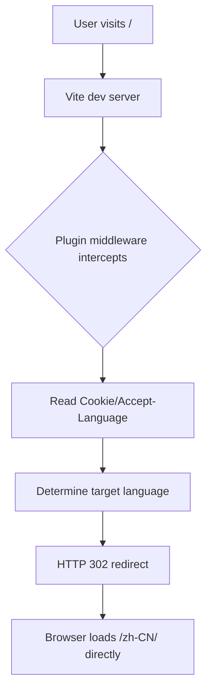
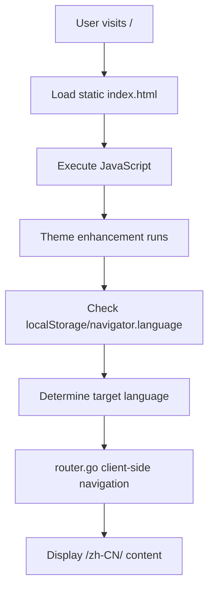

# Development vs Production Environments

This guide explains in detail how the plugin works in different environments and how to test them.

## Environment Differences Overview

| Feature | Development | Production (Static) |
|---------|------------|-------------------|
| **Language Detection** | HTTP Accept-Language header | navigator.language API |
| **Redirect Mechanism** | Server-side 302 redirect | Client-side JavaScript routing |
| **Response Speed** | Immediate redirect | Redirect after JS loads |
| **User Experience** | No flicker | Possible brief flicker |
| **Implementation** | Vite plugin middleware | VitePress theme enhancement |

## How It Works

### Development Workflow



**Code location**: `src/plugin.ts`

```typescript
// Vite plugin runs in dev server
configureServer(server) {
  server.middlewares.use((req, res, next) => {
    // Server-side handles all logic
    // Returns 302 redirect response directly
  })
}
```

### Production Workflow



**Code location**: `src/vitepress/index.ts`

```typescript
// Theme enhancement runs in browser
enhanceApp({ router }) {
  if (!import.meta.env.SSR) {
    // Client-side JavaScript handling
    // Uses VitePress router for navigation
  }
}
```

## Why Two Different Approaches?

### 1. Technical Limitations

**Static hosting platforms** (like GitHub Pages):
- No server, cannot execute server-side code
- Can only serve static files
- All logic must run on client-side

**Development server**:
- Full Node.js environment
- Can intercept and modify HTTP requests
- Can read request headers

### 2. User Experience Optimization

**Development advantages**:
- **Instant redirect**: No need to wait for JavaScript
- **No flicker**: Users don't see intermediate state
- **More accurate**: Accept-Language is more reliable than navigator.language

**Production compromises**:
- Must load page and JavaScript first
- May see "Redirecting..." message
- Relies on browser APIs

## Testing Different Environments

### Testing Production Behavior

Use build and preview to test:

```bash
# Build static files
pnpm docs:build

# Start preview server (simulates static hosting)
pnpm docs:preview
```

Visit `http://localhost:4173/` to test production behavior.

### Testing GitHub Pages Environment

To fully simulate GitHub Pages (including base path):

```bash
# Set environment variable to use base path
GITHUB_ACTIONS=true pnpm docs:build

# Use serve with subpath
serve packages/demo/docs/.vitepress/dist -l 5000

# Visit http://localhost:5000/vue-auto-i18n-router/ (example)
```

## Debugging Tips

### Development Debugging

1. **View network requests**:
   - Open DevTools Network panel
   - Look for 302 redirect requests
   - Check Location response header

2. **Inspect request headers**:
   ```bash
   curl -I http://localhost:5173/ \
     -H "Accept-Language: en-US,en;q=0.9"
   ```

### Production Debugging

1. **View console logs**:
   ```javascript
   // Add debug logs in theme enhancement
   console.log('Current path:', window.location.pathname)
   console.log('Detected locale:', targetLocale)
   ```

2. **Check storage**:
   ```javascript
   // Browser console
   localStorage.getItem('vitepress-preferred-lang')
   document.cookie
   ```

## Common Issues

### Q: Why does it work in development but not production?

**Possible causes**:
1. Theme not properly exported
2. Base path configuration issues
3. JavaScript loading failure

**Solutions**:
- Confirm `.vitepress/theme/index.ts` exports theme correctly
- Check base path configuration
- View browser console for errors

### Q: Can we use a single approach?

**Theoretically yes**, but it sacrifices experience:
- Client-only: Development would also have flicker
- Server-only: Requires SSR deployment (expensive)

The current hybrid approach is the best balance.

### Q: How to support more deployment platforms?

Different platforms have different server-side capabilities:

**Vercel/Netlify**:
- Support redirect rules configuration
- Can add `_redirects` or `vercel.json`

**Cloudflare Pages**:
- Supports Functions
- Can write edge functions for redirects

**Docker/Self-hosted**:
- Can use Nginx configuration
- Full control over server behavior

## Best Practices

1. **During development**: Enjoy smooth server-side redirects
2. **During testing**: Use `pnpm docs:preview` to verify production behavior
3. **Before deployment**: Ensure theme is configured, test client-side redirects
4. **Monitoring**: Add error reporting to understand actual user experience

## Summary

The plugin's dual approach is designed to provide the best experience in different environments:

- **Development**: Leverages server capabilities for best developer experience
- **Production**: Adapts to static deployment limitations while ensuring functionality

Understanding these differences helps with proper configuration and debugging.