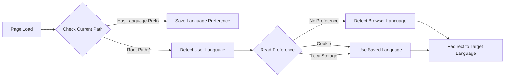

# Theme Integration

This page explains in detail how to integrate theme enhancements via `export { default } from 'vitepress-auto-i18n-router/vitepress'`.

## What is Theme Enhancement?

VitePress Auto i18n Router is not just a Vite plugin, but also provides VitePress theme enhancements. These enhancements handle:

- 🔍 **Client-side language detection** - Automatically detect user language in production
- 💾 **Preference persistence** - Automatically save user's language choice
- 🔄 **Route monitoring** - Monitor route changes and update language preferences
- 🎯 **Auto-redirect** - Automatically redirect to the correct language version based on user preference

## Basic Usage

### Method 1: Direct Export (Recommended)

The simplest integration is to directly export in your theme config file:

```typescript
// docs/.vitepress/theme/index.ts
export { default } from 'vitepress-auto-i18n-router/vitepress'
```

This single line completes all integration! The plugin will automatically:

1. Extend the VitePress default theme
2. Inject language detection and preference management code
3. Handle client-side route redirects

### Method 2: Extend the Imported Theme

If you need to customize other aspects of the theme, you can import and extend:

```typescript
// docs/.vitepress/theme/index.ts
import Theme from 'vitepress-auto-i18n-router/vitepress'
import MyCustomComponent from './MyCustomComponent.vue'
import './custom.css'

export default {
  ...Theme,
  enhanceApp({ app }) {
    // Call the original enhanceApp
    Theme.enhanceApp?.({ app })
    
    // Add your custom logic
    app.component('MyCustomComponent', MyCustomComponent)
  }
}
```

## How It Works

### Development vs Production

Theme enhancement behaves differently in different environments:

#### Development Environment
- Mainly relies on the Vite plugin's server middleware
- Theme enhancement mainly saves user preferences
- Server-side redirects handle most routing logic

#### Production Environment
- Completely relies on client-side JavaScript
- Theme enhancement handles language detection and route redirects
- Uses VitePress's built-in router for SPA navigation

### Language Detection Flow



### Preference Storage Mechanism

User language preferences are saved in two places:

1. **LocalStorage**
   - Key: `vitepress-locale`
   - Persistence: Permanent (unless user clears)
   - Purpose: Client-side language memory

2. **Cookie**
   - Key: `vitepress-locale`
   - Expiry: 1 year
   - Purpose: Server-readable, supports SSR

## Advanced Configuration

### Custom Language Detection Logic

To customize language detection logic, add it when extending the theme:

```typescript
// docs/.vitepress/theme/index.ts
import Theme from 'vitepress-auto-i18n-router/vitepress'

export default {
  ...Theme,
  enhanceApp({ app, router }) {
    Theme.enhanceApp?.({ app, router })
    
    // Custom language detection
    router.onBeforeRouteChange = (to) => {
      // Your custom logic
      console.log('Route about to change to:', to)
    }
  }
}
```

### Integration with Other VitePress Plugins

Theme enhancement integrates seamlessly with other VitePress features:

```typescript
// docs/.vitepress/theme/index.ts
import Theme from 'vitepress-auto-i18n-router/vitepress'
import { h } from 'vue'

export default {
  ...Theme,
  Layout() {
    return h(Theme.Layout, null, {
      // Custom slot content
      'home-hero-before': () => h('div', 'Custom content'),
    })
  }
}
```

## Relationship with Plugin Configuration

Theme enhancement and Vite plugin configuration work together:

```typescript
// docs/.vitepress/config.ts
export default defineConfig({
  vite: {
    plugins: [
      vitepressAutoI18nRouter({
        locales: ['zh-CN', 'en-US'],      // These configs
        defaultLocale: 'zh-CN',         // are automatically
        cookieDomain: '.example.com' // read by the theme
      })
    ]
  }
})
```

Theme enhancement automatically reads plugin configuration, no need to configure twice.

## Important Notes

### 1. Import Path

Make sure to use the correct import path:

```typescript
// ✅ Correct
export { default } from 'vitepress-auto-i18n-router/vitepress'

// ❌ Wrong
export { default } from 'vitepress-auto-i18n-router/theme'
export { default } from 'vitepress-auto-i18n-router'
```

### 2. Theme File Location

The theme file must be located at `docs/.vitepress/theme/index.ts` or `docs/.vitepress/theme/index.js`:

```
docs/
├── .vitepress/
│   ├── config.ts         # VitePress config
│   └── theme/
│       └── index.ts       # Theme config (must be here)
```

### 3. Default Theme Compatibility

Theme enhancement is fully compatible with all VitePress default theme features:

- ✅ Language switcher
- ✅ Search functionality
- ✅ Dark mode
- ✅ Sidebar
- ✅ Navigation bar
- ✅ All built-in components

### 4. TypeScript Support

Theme enhancement provides complete TypeScript type definitions:

```typescript
import type { Theme } from 'vitepress'
import BaseTheme from 'vitepress-auto-i18n-router/vitepress'

const theme: Theme = {
  ...BaseTheme,
  // Your extended configuration
}

export default theme
```

## FAQ

### Q: Why is theme enhancement needed?

**A:** VitePress is a static site generator with no server in production. Theme enhancement provides client-side JavaScript to handle language detection and route redirects.

### Q: Can I skip theme enhancement?

**A:** In development you can (relying on the plugin's server middleware), but production requires theme enhancement for automatic language detection.

### Q: Does theme enhancement affect performance?

**A:** Almost no impact. Enhancement code runs only once on initial page load, less than 2KB after gzip.

### Q: How to debug theme enhancement?

**A:** Check in browser console:

```javascript
// Check current language
localStorage.getItem('vitepress-locale')

// Check Cookie
document.cookie

// Manually clear preference
localStorage.removeItem('vitepress-locale')
```

## Example Projects

See complete integration examples:

- [Basic Example](https://github.com/xbghc/vue-auto-i18n-router/tree/main/packages/demo) - Minimal configuration
- [Advanced Example](https://github.com/xbghc/vue-auto-i18n-router) - With custom theme extensions

## Next Steps

- Learn about [Configuration Options](./configuration) - Detailed configuration parameters
- Check [Deployment Guide](./deployment) - Deployment configuration for different platforms
- Read [FAQ](./faq) - Frequently asked questions