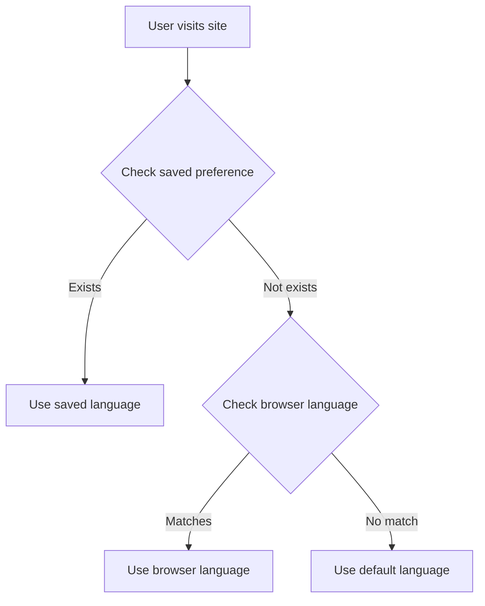

# Introduction

VitePress Auto i18n Router is a powerful Vite plugin that provides zero-config automatic language detection and routing for VitePress static sites.

## What Problems Does It Solve?

When building multilingual documentation sites, we often face these challenges:

- 📝 **Manual route configuration** - Every new page requires multiple config updates
- 🔄 **Complex language switching logic** - Need to implement language detection and switching yourself
- 💾 **User preference persistence** - Need to handle cookies and localStorage
- 🌐 **SEO optimization difficulties** - Multilingual SEO requires lots of extra work
- 🚀 **Tedious deployment configuration** - Different platforms need different redirect rules

VitePress Auto i18n Router solves all these problems at once!

## Core Features

### 🎯 Smart Language Detection

The plugin uses a multi-layer detection strategy to ensure users always see the most appropriate language version:



Detection priority:
1. **Cookie/LocalStorage** - User's previous choice
2. **Accept-Language** - Browser language settings
3. **Default Locale** - Configured default language

### 🔄 Automatic Route Generation

No need to manually configure routes, the plugin handles everything:

- **URL structure standardization** - Unified language prefix pattern `/[locale]/path`
- **Auto-redirect** - Root path automatically redirects to appropriate language
- **Path normalization** - Automatically handles trailing slashes

Example URL structure:
```
/              → Auto-redirect to /zh/ or /en/
/zh/           → Chinese homepage
/zh/guide/     → Chinese guide
/en/           → English homepage
/en/guide/     → English guide
```

### 💾 Preference Persistence

User's language choice is automatically saved:

- **LocalStorage** - Long-term storage, remembered even after closing browser
- **Cookie** - Server-readable, supports SSR scenarios
- **Auto-sync** - Both storages automatically stay in sync

### ⚡ Performance Optimization

- **Zero runtime overhead** - All routes generated at build time
- **Lightweight** - Core code less than 5KB (gzipped)
- **Lazy loading** - Only loads current language content
- **Cache friendly** - Supports CDN and browser caching

## How It Works

### Development Environment

In development mode, the plugin runs as Vite middleware:

```typescript
// Simplified middleware logic
function middleware(req, res, next) {
  const url = req.url
  
  // Parse language from URL
  const { locale, path } = parseUrl(url)
  
  // Redirect if no language prefix
  if (!locale) {
    const targetLocale = detectLanguage(req)
    res.redirect(`/${targetLocale}${path}`)
    return
  }
  
  next()
}
```

### Production Environment

In production, implemented via client-side JavaScript:

```typescript
// Simplified client logic
if (window.location.pathname === '/') {
  const locale = detectUserLanguage()
  router.go(`/${locale}/`)
}
```

### VitePress Theme Enhancement

The plugin enhances the default theme with language tracking:

```typescript
// Automatically track language switches
router.onAfterRouteChange = (path) => {
  const locale = extractLocale(path)
  savePreference(locale)
}
```

## Integration with VitePress

The plugin deeply integrates with VitePress, fully utilizing its features:

### Native Feature Enhancement

- **Language switcher** - Enhances native language switcher with preference memory
- **Search** - Supports multilingual search
- **Sidebar** - Automatically handles multilingual sidebar
- **Nav bar** - Independent navigation config for each language

### Compatibility

- ✅ VitePress 1.0+
- ✅ Vite 5.0+ / 6.0+ / 7.0+
- ✅ Vue 3.3+
- ✅ Node.js 20+

## Use Cases

This plugin is perfect for:

- 📚 **Technical documentation** - API docs, user guides
- 🎓 **Tutorial websites** - Multilingual educational content
- 📖 **Knowledge bases** - Internal company documentation
- 🌍 **International products** - Product docs needing multilingual support
- 📝 **Blogs** - Multilingual technical blogs

## Design Philosophy

### 1. Zero Configuration

Minimal configuration, works out of the box. Just specify language list to get started.

### 2. Progressive Enhancement

Basic features work automatically, advanced features are optionally configurable.

### 3. Developer Friendly

- Clear error messages
- Complete TypeScript support
- Detailed documentation

### 4. User Experience First

- Smart language detection
- Smooth switching experience
- Preference memory

## Next Steps

Ready to get started?

- 📖 Read the [Quick Start](./getting-started) guide
- ⚙️ Check [Configuration Options](./configuration)
- 🚀 Learn about [Deployment](./deployment)

## Get Help

- 💬 [GitHub Discussions](https://github.com/xbghc/vue-auto-i18n-router/discussions) - Questions and discussions
- 🐛 [GitHub Issues](https://github.com/xbghc/vue-auto-i18n-router/issues) - Bug reports
- 📧 Email: ghm20191606@gmail.com