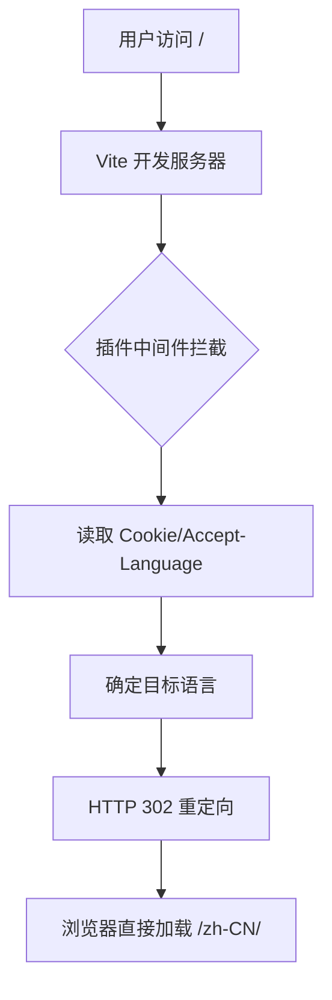
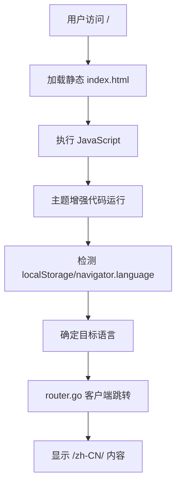

# 开发环境与生产环境

本指南详细解释插件在不同环境下的工作机制，以及如何进行测试。

## 环境差异概览

| 特性 | 开发环境 | 生产环境（静态部署） |
|-----|---------|-------------------|
| **语言检测方式** | HTTP Accept-Language 头 | navigator.language API |
| **重定向机制** | 服务器端 302 重定向 | 客户端 JavaScript 路由 |
| **响应速度** | 立即重定向 | 需要加载 JS 后重定向 |
| **用户体验** | 无闪烁 | 可能有短暂闪烁 |
| **实现位置** | Vite 插件中间件 | VitePress 主题增强 |

## 工作原理详解

### 开发环境工作流程



**代码位置**：`src/plugin.ts`

```typescript
// Vite 插件在开发服务器中运行
configureServer(server) {
  server.middlewares.use((req, res, next) => {
    // 服务器端处理所有逻辑
    // 直接返回 302 重定向响应
  })
}
```

### 生产环境工作流程



**代码位置**：`src/vitepress/index.ts`

```typescript
// 主题增强在浏览器中运行
enhanceApp({ router }) {
  if (!import.meta.env.SSR) {
    // 客户端 JavaScript 处理
    // 使用 VitePress router 进行导航
  }
}
```

## 为什么需要两套方案？

### 1. 技术限制

**静态部署平台**（如 GitHub Pages）：
- 没有服务器，无法执行服务器端代码
- 只能提供静态文件
- 所有逻辑必须在客户端执行

**开发服务器**：
- 有完整的 Node.js 环境
- 可以拦截和修改 HTTP 请求
- 能够读取请求头信息

### 2. 用户体验优化

**开发环境的优势**：
- **即时重定向**：不需要等待 JavaScript 加载
- **无闪烁**：用户看不到中间状态
- **更准确**：Accept-Language 比 navigator.language 更可靠

**生产环境的妥协**：
- 必须先加载页面和 JavaScript
- 可能看到 "Redirecting..." 提示
- 依赖浏览器 API

## 测试不同环境

### 测试生产环境行为

使用构建并预览的方式测试：

```bash
# 构建静态文件
pnpm docs:build

# 启动预览服务器（模拟静态托管）
pnpm docs:preview
```

访问 `http://localhost:4173/` 测试生产环境行为。

### 测试 GitHub Pages 环境

要完全模拟 GitHub Pages 环境（包括 base 路径）：

```bash
# 设置环境变量来使用 base 路径
GITHUB_ACTIONS=true pnpm docs:build

# 使用 serve 并指定子路径
serve packages/demo/docs/.vitepress/dist -l 5000

# 访问 http://localhost:5000/vue-auto-i18n-router/ (示例)
```

## 调试技巧

### 开发环境调试

1. **查看网络请求**：
   - 打开 DevTools Network 面板
   - 查看 302 重定向请求
   - 检查 Location 响应头

2. **检查请求头**：
   ```bash
   curl -I http://localhost:5173/ \
     -H "Accept-Language: en-US,en;q=0.9"
   ```

### 生产环境调试

1. **查看控制台日志**：
   ```javascript
   // 在主题增强中添加调试日志
   console.log('Current path:', window.location.pathname)
   console.log('Detected locale:', targetLocale)
   ```

2. **检查存储**：
   ```javascript
   // 浏览器控制台
   localStorage.getItem('vitepress-preferred-lang')
   document.cookie
   ```

## 常见问题

### Q: 为什么开发环境正常但生产环境不工作？

**可能原因**：
1. 主题没有正确导出
2. base 路径配置问题
3. JavaScript 加载失败

**解决方法**：
- 确认 `.vitepress/theme/index.ts` 正确导出主题
- 检查 base 路径配置是否正确
- 查看浏览器控制台错误

### Q: 能否统一使用一种方案？

**理论上可以**，但会牺牲体验：
- 只用客户端：开发时也会有闪烁
- 只用服务器端：需要 SSR 部署（成本高）

当前的混合方案是最佳平衡。

### Q: 如何支持更多部署平台？

不同平台有不同的服务器端能力：

**Vercel/Netlify**：
- 支持重定向规则配置
- 可以添加 `_redirects` 或 `vercel.json`

**Cloudflare Pages**：
- 支持 Functions
- 可以编写边缘函数处理重定向

**Docker/自托管**：
- 可以使用 Nginx 配置
- 完全控制服务器行为

## 最佳实践

1. **开发时**：享受服务器端重定向的流畅体验
2. **测试时**：使用 `pnpm docs:preview` 验证生产环境行为
3. **部署前**：确保主题正确配置，测试客户端重定向
4. **监控**：添加错误上报，了解用户实际体验

## 总结

插件的双重方案设计是为了在不同环境下都能提供最佳体验：

- **开发环境**：利用服务器能力，提供最佳开发体验
- **生产环境**：适应静态部署限制，确保功能可用

理解这种差异有助于正确配置和调试问题。