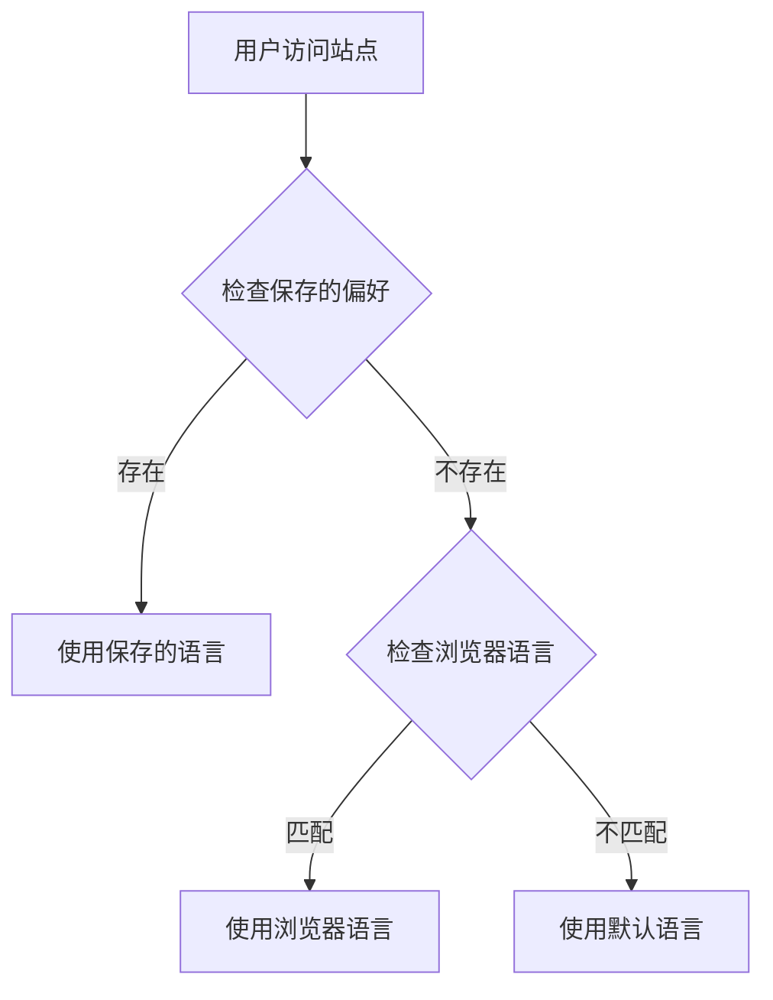

# 介绍

VitePress Auto i18n Router 是一个强大的 Vite 插件，为 VitePress 静态站点提供零配置的自动语言检测和路由功能。

## 它解决了什么问题？

在构建多语言文档站点时，我们经常遇到这些挑战：

- 📝 **手动维护路由配置** - 每添加一个页面都要更新多处配置
- 🔄 **复杂的语言切换逻辑** - 需要自己实现语言检测和切换
- 💾 **用户偏好持久化** - 需要处理 Cookie 和 localStorage
- 🌐 **SEO 优化困难** - 多语言 SEO 需要大量额外工作
- 🚀 **部署配置繁琐** - 不同平台需要不同的重定向规则

VitePress Auto i18n Router 一次性解决所有这些问题！

## 核心功能

### 🎯 智能语言检测

插件使用多层检测策略，确保用户总能看到最合适的语言版本：



检测优先级：
1. **Cookie/LocalStorage** - 用户之前的选择
2. **Accept-Language** - 浏览器语言设置
3. **Default Locale** - 配置的默认语言

### 🔄 自动路由生成

无需手动配置路由，插件会自动处理：

- **URL 结构标准化** - 统一的语言前缀模式 `/[locale]/path`
- **自动重定向** - 访问根路径自动跳转到合适的语言
- **路径规范化** - 自动处理尾部斜杠

示例 URL 结构：
```
/              → 自动重定向到 /zh/ 或 /en/
/zh/           → 中文首页
/zh/guide/     → 中文指南
/en/           → 英文首页  
/en/guide/     → 英文指南
```

### 💾 偏好持久化

用户的语言选择会被自动保存：

- **LocalStorage** - 长期保存，即使关闭浏览器也会记住
- **Cookie** - 服务端可读，支持 SSR 场景
- **自动同步** - 两种存储自动保持同步

### ⚡ 性能优化

- **零运行时开销** - 所有路由在构建时生成
- **轻量级** - 核心代码不到 5KB（gzip 后）
- **懒加载** - 只加载当前语言的内容
- **缓存友好** - 支持 CDN 和浏览器缓存

## 工作原理

### 开发环境

在开发模式下，插件作为 Vite 中间件运行：

```typescript
// 简化的中间件逻辑
function middleware(req, res, next) {
  const url = req.url
  
  // 解析 URL 中的语言
  const { locale, path } = parseUrl(url)
  
  // 如果没有语言前缀，进行重定向
  if (!locale) {
    const targetLocale = detectLanguage(req)
    res.redirect(`/${targetLocale}${path}`)
    return
  }
  
  next()
}
```

### 生产环境

在生产环境，通过客户端 JavaScript 实现：

```typescript
// 简化的客户端逻辑
if (window.location.pathname === '/') {
  const locale = detectUserLanguage()
  router.go(`/${locale}/`)
}
```

### VitePress 主题增强

插件增强了默认主题，添加语言追踪功能：

```typescript
// 自动追踪语言切换
router.onAfterRouteChange = (path) => {
  const locale = extractLocale(path)
  savePreference(locale)
}
```

## 与 VitePress 的集成

插件与 VitePress 深度集成，充分利用其功能：

### 原生功能增强

- **语言切换器** - 增强原生语言切换器，添加偏好记忆
- **搜索** - 支持多语言搜索
- **侧边栏** - 自动处理多语言侧边栏
- **导航栏** - 每个语言独立的导航配置

### 兼容性

- ✅ VitePress 1.0+
- ✅ Vite 5.0+ / 6.0+ / 7.0+
- ✅ Vue 3.3+
- ✅ Node.js 20+

## 使用场景

这个插件特别适合：

- 📚 **技术文档** - API 文档、用户指南
- 🎓 **教程网站** - 多语言教学内容
- 📖 **知识库** - 企业内部文档
- 🌍 **国际化产品** - 需要多语言支持的产品文档
- 📝 **博客** - 多语言技术博客

## 设计理念

### 1. 零配置

最小化配置，开箱即用。只需指定语言列表即可工作。

### 2. 渐进增强

基础功能自动工作，高级功能可选配置。

### 3. 开发者友好

- 清晰的错误提示
- 完整的 TypeScript 支持
- 详细的文档

### 4. 用户体验优先

- 智能语言检测
- 流畅的切换体验
- 偏好记忆

## 下一步

准备好开始了吗？

- 📖 阅读[快速开始](./getting-started)指南
- ⚙️ 查看[配置选项](./configuration)
- 🚀 了解[部署指南](./deployment)

## 获取帮助

- 💬 [GitHub Discussions](https://github.com/xbghc/vue-auto-i18n-router/discussions) - 提问和讨论
- 🐛 [GitHub Issues](https://github.com/xbghc/vue-auto-i18n-router/issues) - Bug 报告
- 📧 邮箱：ghm20191606@gmail.com