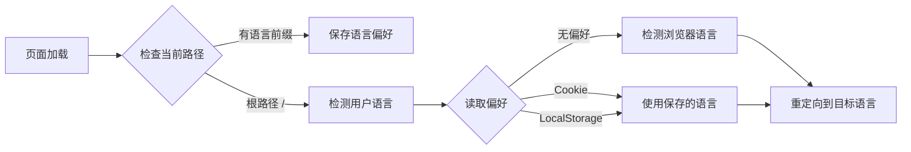

# 主题集成

本页面详细介绍了如何通过 `export { default } from 'vitepress-auto-i18n-router/vitepress'` 集成主题增强功能。

## 什么是主题增强？

VitePress Auto i18n Router 不仅是一个 Vite 插件，还提供了 VitePress 主题增强功能。这个增强功能负责：

- 🔍 **客户端语言检测** - 在生产环境中自动检测用户语言
- 💾 **偏好持久化** - 自动保存用户的语言选择
- 🔄 **路由监听** - 监听路由变化并更新语言偏好
- 🎯 **自动重定向** - 根据用户偏好自动重定向到正确的语言版本

## 基础用法

### 方式一：直接导出（推荐）

最简单的集成方式是在你的主题配置文件中直接导出：

```typescript
// docs/.vitepress/theme/index.ts
export { default } from 'vitepress-auto-i18n-router/vitepress'
```

这一行代码就完成了所有集成工作！插件会自动：

1. 扩展 VitePress 默认主题
2. 注入语言检测和偏好管理代码
3. 处理客户端路由重定向

### 方式二：扩展导入的主题

如果你需要自定义主题的其他方面，可以导入并扩展：

```typescript
// docs/.vitepress/theme/index.ts
import Theme from 'vitepress-auto-i18n-router/vitepress'
import MyCustomComponent from './MyCustomComponent.vue'
import './custom.css'

export default {
  ...Theme,
  enhanceApp({ app }) {
    // 调用原始的 enhanceApp
    Theme.enhanceApp?.({ app })
    
    // 添加你的自定义逻辑
    app.component('MyCustomComponent', MyCustomComponent)
  }
}
```

## 工作原理

### 开发环境 vs 生产环境

主题增强在不同环境下有不同的行为：

#### 开发环境
- 主要依赖 Vite 插件的服务端中间件
- 主题增强主要负责保存用户偏好
- 服务端重定向处理大部分路由逻辑

#### 生产环境
- 完全依赖客户端 JavaScript
- 主题增强负责语言检测和路由重定向
- 使用 VitePress 的内置路由器进行 SPA 导航

### 语言检测流程



### 偏好存储机制

用户的语言偏好会被保存在两个地方：

1. **LocalStorage**
   - 键名：`vitepress-locale`
   - 持久化时间：永久（除非用户清除）
   - 作用：客户端语言记忆

2. **Cookie**
   - 键名：`vitepress-locale`
   - 有效期：1 年
   - 作用：服务端可读，支持 SSR

## 高级配置

### 自定义语言检测逻辑

如果需要自定义语言检测逻辑，可以在扩展主题时添加：

```typescript
// docs/.vitepress/theme/index.ts
import Theme from 'vitepress-auto-i18n-router/vitepress'

export default {
  ...Theme,
  enhanceApp({ app, router }) {
    Theme.enhanceApp?.({ app, router })
    
    // 自定义语言检测
    router.onBeforeRouteChange = (to) => {
      // 你的自定义逻辑
      console.log('路由即将变化到:', to)
    }
  }
}
```

### 与其他 VitePress 插件集成

主题增强可以与其他 VitePress 功能无缝集成：

```typescript
// docs/.vitepress/theme/index.ts
import Theme from 'vitepress-auto-i18n-router/vitepress'
import { h } from 'vue'

export default {
  ...Theme,
  Layout() {
    return h(Theme.Layout, null, {
      // 自定义插槽内容
      'home-hero-before': () => h('div', 'Custom content'),
    })
  }
}
```

## 与插件配置的关系

主题增强和 Vite 插件配置协同工作：

```typescript
// docs/.vitepress/config.ts
export default defineConfig({
  vite: {
    plugins: [
      vitepressAutoI18nRouter({
        locales: ['zh', 'en'],      // 这些配置
        defaultLocale: 'zh',         // 会被主题
        cookieDomain: '.example.com' // 自动读取
      })
    ]
  }
})
```

主题增强会自动读取插件配置，无需重复配置。

## 注意事项

### 1. 导入路径

确保使用正确的导入路径：

```typescript
// ✅ 正确
export { default } from 'vitepress-auto-i18n-router/vitepress'

// ❌ 错误
export { default } from 'vitepress-auto-i18n-router/theme'
export { default } from 'vitepress-auto-i18n-router'
```

### 2. 主题文件位置

主题文件必须位于 `docs/.vitepress/theme/index.ts` 或 `docs/.vitepress/theme/index.js`：

```
docs/
├── .vitepress/
│   ├── config.ts         # VitePress 配置
│   └── theme/
│       └── index.ts       # 主题配置（必须在此位置）
```

### 3. 与默认主题的兼容性

主题增强完全兼容 VitePress 默认主题的所有功能：

- ✅ 语言切换器
- ✅ 搜索功能
- ✅ 暗色模式
- ✅ 侧边栏
- ✅ 导航栏
- ✅ 所有内置组件

### 4. TypeScript 支持

主题增强提供完整的 TypeScript 类型定义：

```typescript
import type { Theme } from 'vitepress'
import BaseTheme from 'vitepress-auto-i18n-router/vitepress'

const theme: Theme = {
  ...BaseTheme,
  // 你的扩展配置
}

export default theme
```

## 常见问题

### Q: 为什么需要主题增强？

**A:** VitePress 是静态站点生成器，生产环境没有服务器。主题增强提供客户端 JavaScript 来处理语言检测和路由重定向。

### Q: 可以不使用主题增强吗？

**A:** 在开发环境可以（依赖插件的服务端中间件），但生产环境必须使用主题增强才能实现自动语言检测。

### Q: 主题增强会影响性能吗？

**A:** 几乎没有影响。增强代码仅在页面初始加载时运行一次，gzip 后不到 2KB。

### Q: 如何调试主题增强？

**A:** 在浏览器控制台查看：

```javascript
// 查看当前语言
localStorage.getItem('vitepress-locale')

// 查看 Cookie
document.cookie

// 手动清除偏好
localStorage.removeItem('vitepress-locale')
```

## 示例项目

查看完整的集成示例：

- [基础示例](https://github.com/xbghc/vue-auto-i18n-router/tree/main/packages/demo) - 最小化配置
- [高级示例](https://github.com/xbghc/vue-auto-i18n-router) - 包含自定义主题扩展

## 下一步

- 了解[配置选项](./configuration) - 详细的配置参数说明
- 查看[部署指南](./deployment) - 不同平台的部署配置
- 阅读[常见问题](./faq) - 常见问题解答